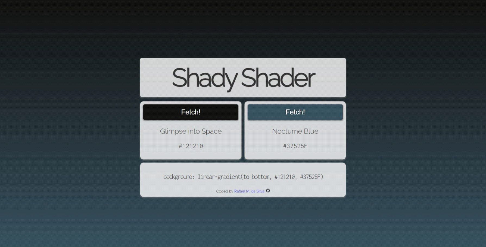

## Shady Shader

This __React.js__ application takes the user through a curated color pool paired with their respective playful names, all provided by an external __API__. The selected colors will be applied to the background as a gradient, the user is free to randomize each color individually.

This Application utilizes __Hooks__, __Reusable Components__, __CSS Modules__ and an organized file structure.

### Features

- API Integration
- Random Data Generation
- Responsive Design
- User-Friendly Interface

### How to Use

1. Visit the website by clicking the __GitHub Pages__  button located down bellow
2. Once there, click the __Fetch!__ button to display a new color for each side of the gradient

__Hint:__ Every relevant text content can be __quick copied__ to the clipboard by simply clicking on it

### To-Do

- Gradient direction button
- More animations
- Further code optimization

### Live Demo

### Contributions

Feel free to make any suggestions by creating an issue.

### Acknowledgments

Special thanks to the team at [Color Names](https://github.com/meodai/color-names "Color Names Repository") for providing the API that powers this project.

### Disclaimer

The names fetched from the API are for **depiction only** and may not reflect my own personal opinions or beliefs.